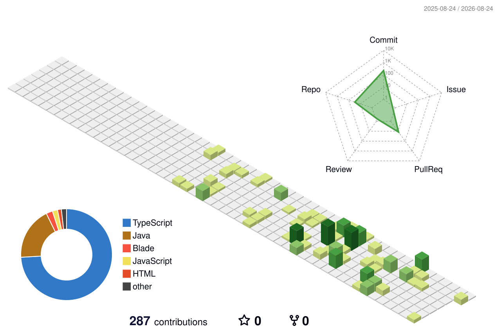

<div align="center">


<br/>

<a href="https://gustavodev.dev"></a>
<a href="https://www.linkedin.com/in/gustavo-barbosa-lima-341886278"></a>

</div>

<br/>

## Sobre mim

Desenvolvedor full-stack em Palmas, Tocantins, cursando Sistemas de Informação na UNITINS.

Trabalho com sites autorais: cada projeto nasce com identidade visual própria, do layout ao back-end. Nada de tema pronto com a logo trocada em cima.

Hoje estou tocando a plataforma da Federação de Handebol do Tocantins e o FinControl, um sistema de controle financeiro separado em API e front-end.

```java
public class Gustavo {
    String base       = "Palmas, Tocantins 🇧🇷";
    String formacao   = "Sistemas de Informação, UNITINS";
    String foco       = "Sites autorais com identidade visual própria";
    String lema       = "Codigo bom é código que ninguém confunde com template";
}
```

<!-- Esse bloco de "código" é opcional. Se achar muito meme, apaga e deixa só o texto corrido. Edita os valores do jeito que quiser. -->

## Stack

<div align="center">


<!-- Adiciona ou remove badges conforme sua stack real. Padrão: fundo 0d1117, logo 22c55e.
Lista de logos disponíveis: https://simpleicons.org -->

</div>

## Projetos em destaque

<!-- Troca pelos teus projetos reais. Formato: nome com link, uma linha de descrição. -->

| Projeto | Descrição | Stack |
|---------|-----------|-------|
| **[FHT](https://github.com/Gustavo16378)** | Plataforma da Federação de Handebol do Tocantins | <!-- stack --> |
| **[FinControl Web](https://github.com/Gustavo16378/fincontrol-web)** | Front-end do sistema de controle financeiro | <!-- stack --> |
| **[FinControl API](https://github.com/Gustavo16378/fincontrol-api)** | API do sistema de controle financeiro | <!-- stack --> |

## Números

<div align="center">


<br/><br/>


</div>

## Contribuições em 3D

<div align="center">



</div>

<br/>

<div align="center">

<sub>Feito com café e commits em Palmas, TO.</sub>

<br/>

<sub>Aberto a freela e a projeto que precise de cara própria. Chama no LinkedIn.</sub>

</div>
