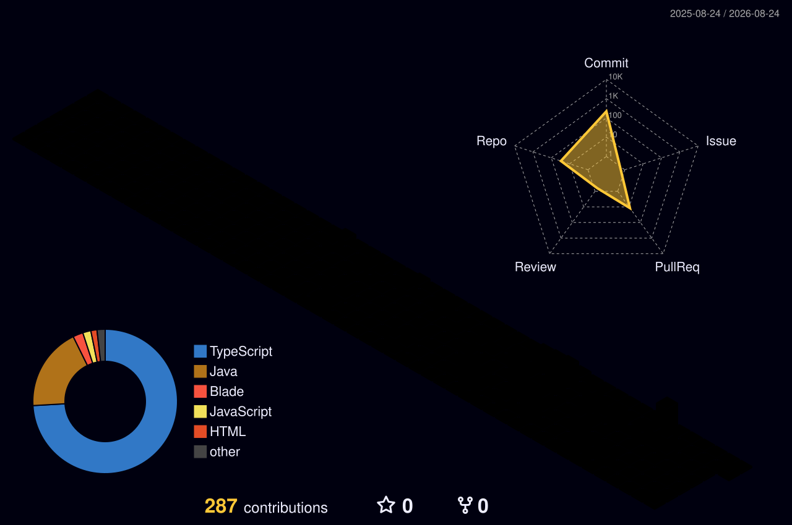

<div align="center">


<br/>

<a href="https://gustavodev.dev"></a>
<a href="https://www.linkedin.com/in/gustavo-barbosa-lima-341886278"></a>

</div>

<br/>

## Sobre mim

Desenvolvedor full-stack de Palmas, Tocantins. Trabalho com desenvolvimento web profissional e toco meus projetos como freelancer na **Gustavo Dev**, além de cursar Sistemas de Informação na UNITINS.

Meu diferencial é simples: eu não entrego template. Cada site que eu construo nasce com identidade visual própria, pensado como peça única, do conceito no Figma até o deploy. Design autoral e engenharia de verdade no mesmo projeto.

```java
public class Gustavo {
    String base    = "Palmas, Tocantins 🇧🇷";
    String formacao = "Sistemas de Informação, UNITINS";
    String marca   = "Gustavo Dev";
    String lema    = "Site bom é aquele que ninguém confunde com template";
}
```

## Stack

<div align="center">

**Front-end**


**Back-end**


**Banco e infra**


**Design e ferramentas**


</div>

## Projetos em destaque

| Projeto | Descrição | Stack |
|---------|-----------|-------|
| **[FHT](https://github.com/Gustavo16378/FHT-SITE)** | Plataforma da Federação de Handebol do Tocantins, com autenticação JWT, conformidade LGPD e CI/CD | Java, Quarkus, PostgreSQL, Cloudflare |
| **[FinControl Web](https://github.com/Gustavo16378/fincontrol-web)** | Front-end do sistema de controle financeiro | Angular, TypeScript |
| **[FinControl API](https://github.com/Gustavo16378/fincontrol-api)** | API REST do sistema de controle financeiro | Java, Quarkus, PostgreSQL |
| **[Portfólio](https://gustavodev.dev)** | Meu site autoral, vitrine dos projetos da Gustavo Dev | React, Vite, TypeScript, Tailwind |

## Números

<div align="center">


<br/><br/>


</div>

## Contribuições em 3D

<div align="center">



</div>

<br/>

<div align="center">

<sub>Feito em Palmas, TO. Um commit de cada vez.</sub>

</div>
